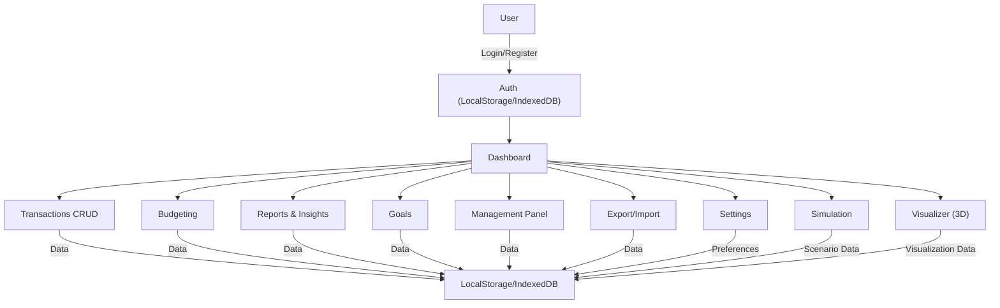
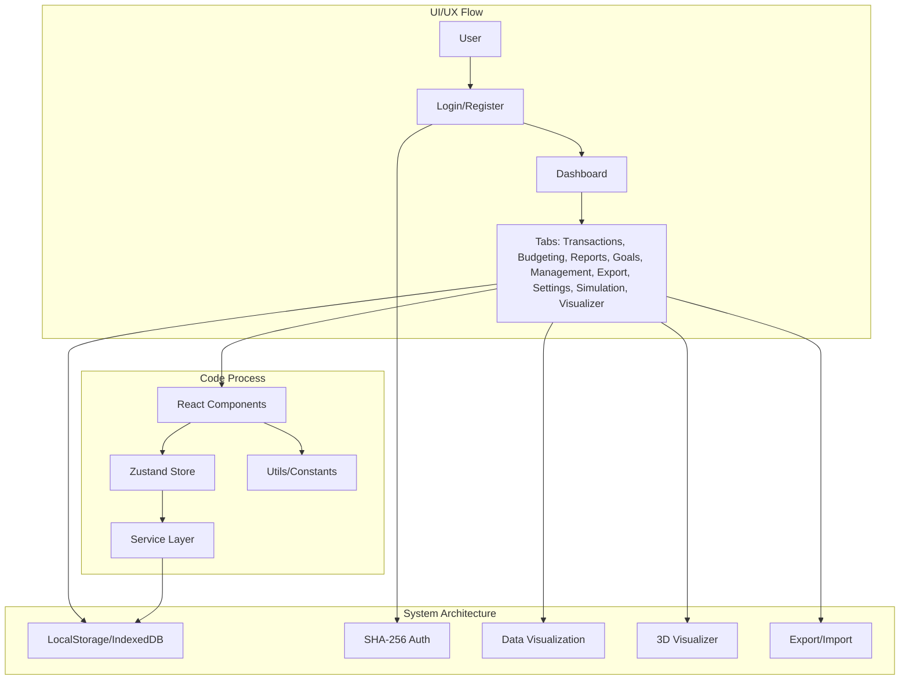
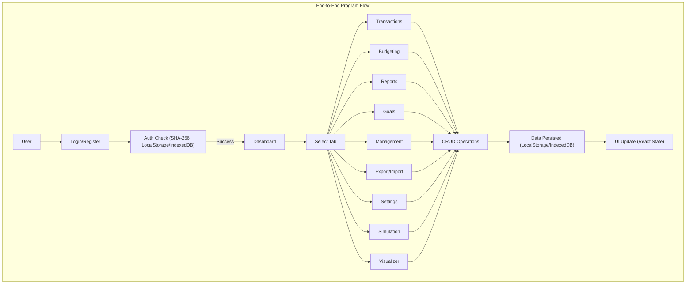
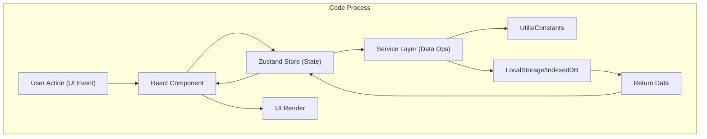

# robotjaol | Finance

## Summary
Personal & executive finance dashboard. Offline-first, secure, modular, and visually rich. All data and auth are local (no backend).

---

## System Flow

---

## UI/UX, System, and Code Process

---

## End-to-End Program Flow

---

## Code Process

---

## Tech Stack
- React (Vite)
- Zustand (state)
- Tailwind CSS, shadcn/ui
- IndexedDB/localStorage
- SHA-256 (auth)
- Recharts, Three.js, @react-three/fiber

## Features
- Multi-tab dashboard: Overview, Transactions, Budgeting, Reports, Goals, Management, Export, Settings, Simulation, Visualizer
- Full offline support
- Local-only authentication
- Data export/import (.csv, .xlsx, .pdf, .json)
- Animated charts, 3D visualizer
- Mobile-first, dark mode, accessible

## Architecture
- All data & auth: browser storage
- Modular React components
- Zustand for state
- Service layer for data ops
- Utility & constants modules

---

## Usage
- Install: `pnpm install`
- Dev: `pnpm run dev`
- Build: `pnpm run build`

---

For details, see code and comments. No backend required.

