# robotjaol | Finance: Personal and Executive Financial Management Web Application

## Project Overview

`robotjaol | Finance` is a highly responsive, sleek, and futuristic web application designed for comprehensive personal and executive financial management. The application provides an immersive and data-rich experience, comparable to elite fintech dashboards, by combining elegant minimalism with high interactivity, real-time updates, and ultra-smooth performance. 

**Key Architectural Decision**: Full offline capability after initial load, relying on client-side storage mechanisms such as `localStorage`, `IndexedDB`, and local JSON files for all user data and authentication details, thereby avoiding complex backend infrastructures.

## 🏗️ System Architecture

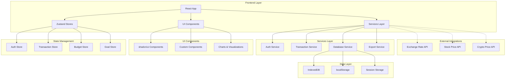

## 🔄 Application Flow Diagram

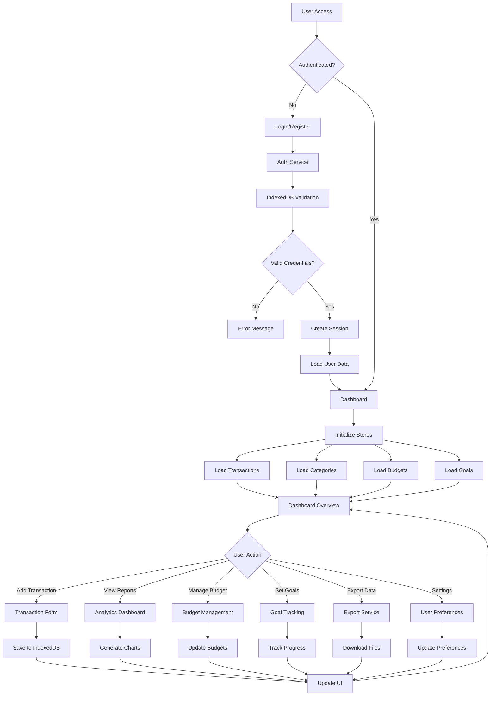

## 🎨 UI/UX Architecture

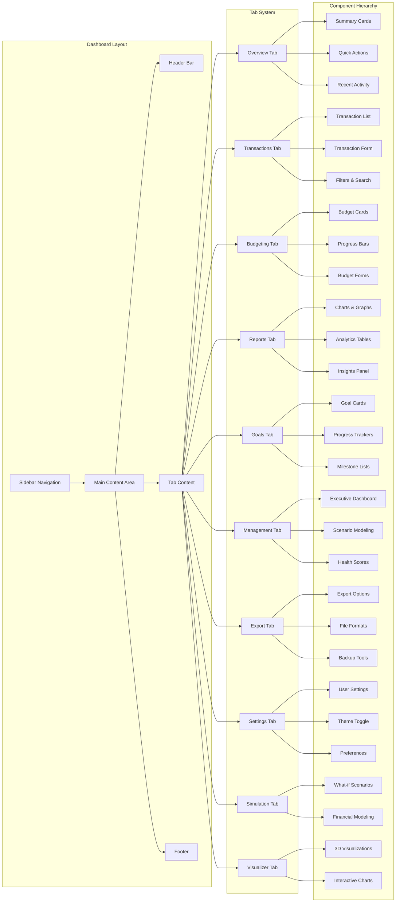

## 💾 Data Architecture

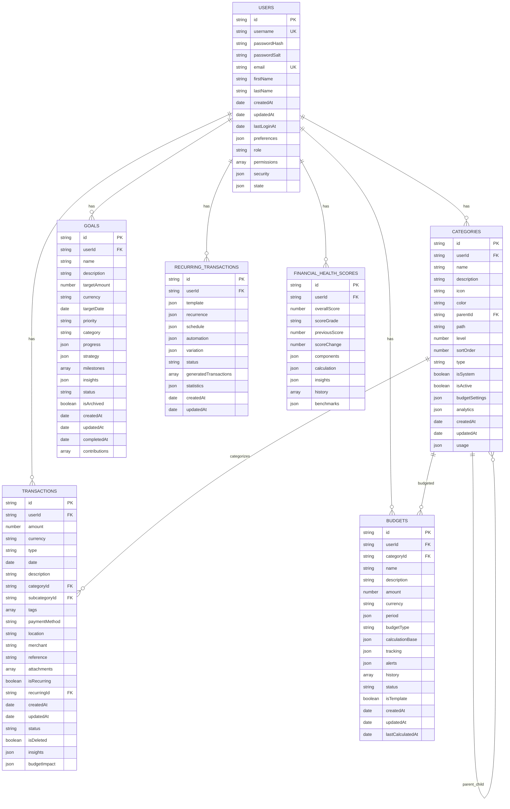

## 🔐 Authentication Flow

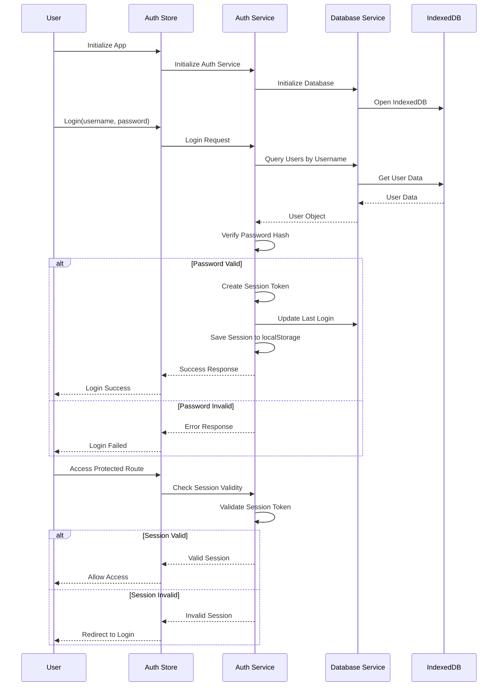

## 📊 Transaction Management Flow

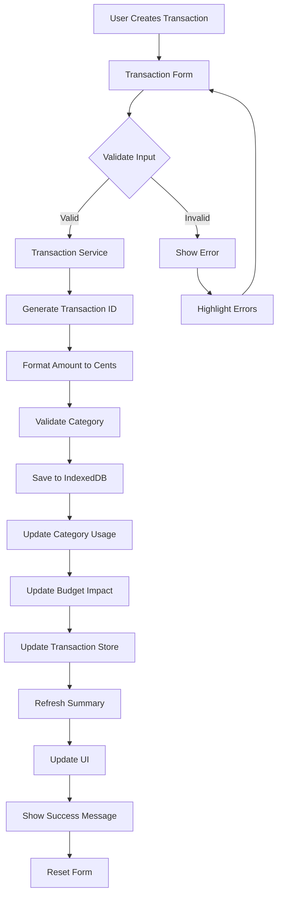

## 🎯 State Management Architecture

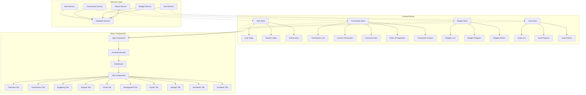

## 🛠️ Technology Stack

### Frontend:
*   **Framework:** React 19.1.0 with Vite 6.3.5
*   **Styling:** Tailwind CSS 4.1.7 with shadcn/ui components
*   **Icons:** lucide-react 0.510.0
*   **Animations:** Framer Motion 12.15.0
*   **State Management:** Zustand 5.0.6
*   **Notifications:** react-toastify 11.0.5 & sonner 2.0.3
*   **Data Visualization:** Recharts 2.15.3
*   **3D Visualization:** Three.js 0.178.0 & @react-three/fiber 9.1.4
*   **Forms:** react-hook-form 7.56.3 with zod 3.24.4 validation
*   **Routing:** react-router-dom 7.6.1

### Backend (Client-side Emulation):
*   **Data Storage:** IndexedDB with localStorage fallback
*   **Authentication:** Local username-password with SHA-256 hashing
*   **Encryption:** CryptoJS 4.2.0 for password hashing
*   **File Handling:** Local file system integration

### Development & Deployment:
*   **Package Manager:** pnpm 10.4.1
*   **Code Quality:** ESLint 9.25.0 + Prettier
*   **Deployment:** Vercel-ready configuration
*   **Testing:** Vitest (configured for future use)

## 🎨 UI Component Architecture

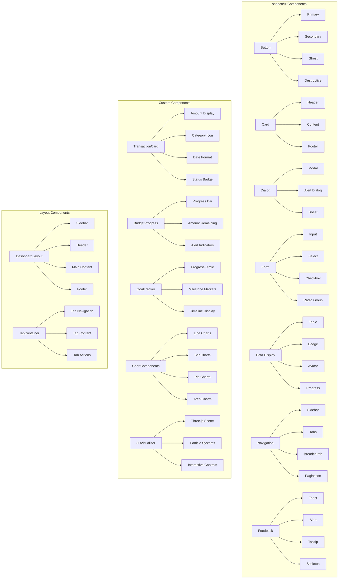

## 🔧 Development Workflow

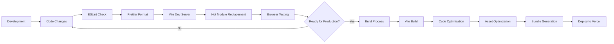

## 📁 Project Structure

```
robotjaol-finance/
├── public/                   # Static assets
│   └── favicon.ico
├── src/
│   ├── assets/               # Images and media
│   │   └── react.svg
│   ├── components/           # Reusable UI components
│   │   └── ui/               # shadcn/ui components (40+ components)
│   │       ├── accordion.jsx
│   │       ├── alert-dialog.jsx
│   │       ├── button.jsx
│   │       ├── card.jsx
│   │       ├── chart.jsx
│   │       ├── dialog.jsx
│   │       ├── form.jsx
│   │       ├── sidebar.jsx
│   │       └── ... (35 more components)
│   ├── constants/            # Application constants
│   │   └── index.js         # Database config, UI constants, validation rules
│   ├── hooks/                # Custom React hooks
│   │   └── use-mobile.js    # Mobile detection hook
│   ├── lib/                  # Utility functions
│   │   └── utils.js         # Tailwind utilities
│   ├── services/             # Data services and API integrations
│   │   ├── auth.js          # Authentication service (545 lines)
│   │   ├── database.js      # IndexedDB service (360 lines)
│   │   └── transactions.js  # Transaction service (612 lines)
│   ├── stores/               # Zustand state management stores
│   │   ├── authStore.js     # Authentication store (209 lines)
│   │   └── transactionStore.js # Transaction store (452 lines)
│   ├── types/                # JSDoc type definitions
│   │   └── index.js         # Complete type system (173 lines)
│   ├── utils/                # Utility functions
│   │   └── index.js         # Core utilities (386 lines)
│   ├── App.css               # Global styles
│   ├── App.jsx               # Main application component
│   ├── index.css             # Base styles
│   └── main.jsx              # Entry point
├── components.json           # shadcn/ui configuration
├── eslint.config.js          # ESLint configuration
├── index.html                # Main HTML file
├── jsconfig.json             # JavaScript configuration
├── package.json              # Project dependencies and scripts
├── pnpm-lock.yaml            # pnpm lock file
├── README.md                 # Project documentation
└── vite.config.js            # Vite bundler configuration
```

## 🚀 Key Features

### 1. **Overview Dashboard**
- High-level summary of total balance, net cash flow, upcoming bills, and recent activity
- Real-time financial health indicators
- Quick action buttons for common tasks

### 2. **Transaction Management**
- Full CRUD operations for income and expenses
- Advanced filtering and search capabilities
- Tag-based categorization system
- File attachment support
- Indonesian Rupiah (Rp) formatting using `Intl.NumberFormat('id-ID')`

### 3. **Budgeting System**
- Category-specific budget definition
- Real-time usage monitoring
- Animated progress indicators
- Alert system for spending limits
- Budget templates and recurring budgets

### 4. **Reports & Analytics**
- Intelligent analytics through static and animated infographics
- AI-powered recommendations
- Historical comparisons
- Real-time line graphs, bar charts, candlestick-like charts, and interactive pie charts
- Export capabilities in multiple formats

### 5. **Goal Tracking**
- Visual goal trackers with progress indicators
- Expected completion timelines
- Automatic budget allocation suggestions
- Milestone tracking and rewards

### 6. **Executive Management Panel**
- Cross-year comparisons
- Scenario modeling (e.g., "What if my salary increases by 15%?")
- Aggregated summaries
- Financial Health Score calculation
- Executive-level insights and recommendations

### 7. **Export & Documents**
- Data exports in `.xlsx`, `.csv`, and `.pdf` formats
- Monthly report generation
- Automated backups
- Data import/export via `.json` files

### 8. **Settings & Preferences**
- User preference management
- Language and currency format settings
- Theme toggle (dark/light mode)
- User role management
- Privacy and security settings

### 9. **Simulation Engine**
- Sandbox for creating "what-if" financial scenarios
- Impact analysis on budgets and goals
- Risk assessment tools
- Financial modeling capabilities

### 10. **3D Visualizer**
- Immersive 3D environment powered by Three.js
- Cashflow visualization as flowing particles or waves
- Interactive financial data representation
- Real-time data integration

## 🔒 Security Features

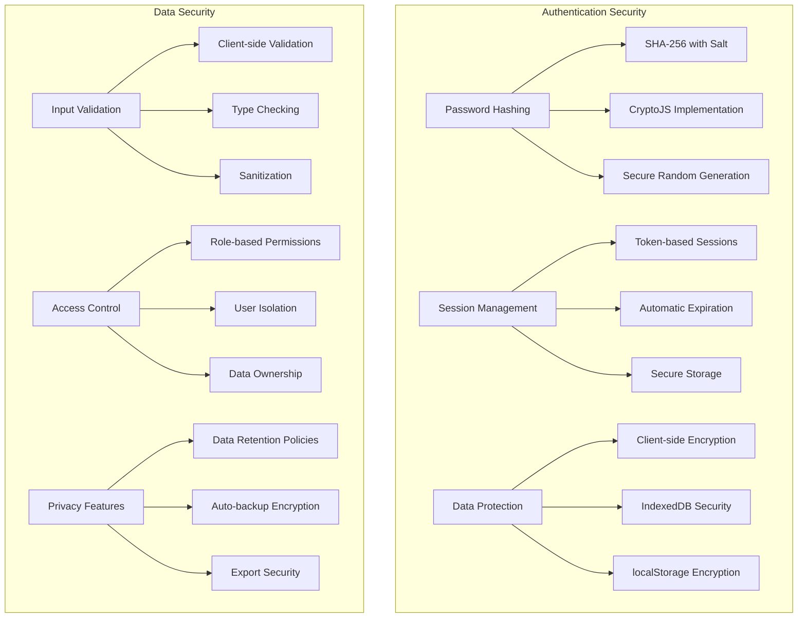

## 📱 Responsive Design

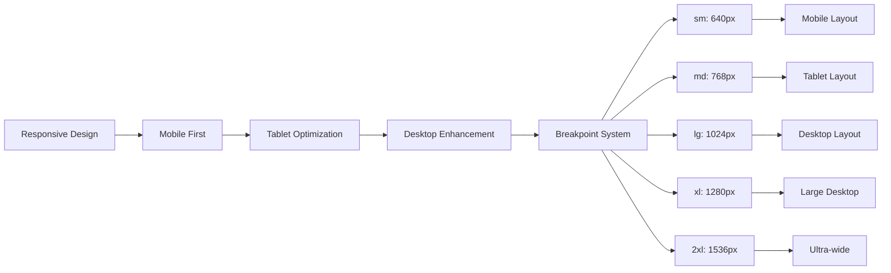

## 🎯 Performance Optimization

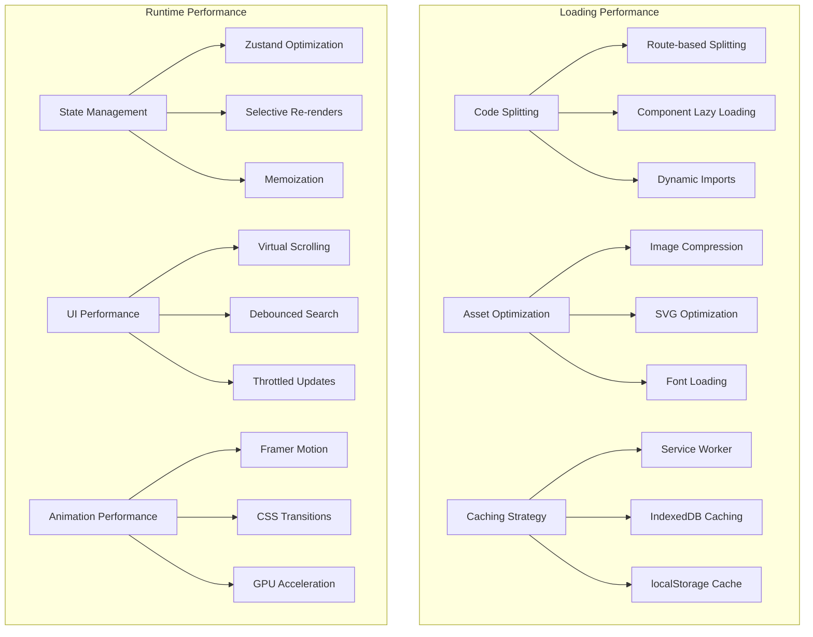

## 🚀 Installation

To set up the project locally, follow these steps:

1.  **Clone the repository:**
    ```bash
    git clone <repository_url>
    cd robotjaol-finance
    ```

2.  **Install dependencies:**
    This project uses `pnpm` as its package manager. If you don't have `pnpm` installed, you can install it via npm:
    ```bash
    npm install -g pnpm
    ```
    Then, install the project dependencies:
    ```bash
    pnpm install
    ```

## 🎮 Usage

To run the application in development mode:

```bash
pnpm run dev
```

This will start the development server, and you can access the application in your browser at `http://localhost:5173` (or another port if 5173 is in use).

## 🛠️ Development Guidelines

*   **Styling:** Prefer Tailwind CSS for styling. `shadcn/ui` components are pre-installed and configured.
*   **Icons:** Use `lucide-react` for icons.
*   **Animations:** `Framer Motion` is available for subtle UI animations.
*   **State Management:** Use `Zustand` for global state management and `React Context` for local state.
*   **Data Visualization:** `Recharts` is pre-installed for charting. `Three.js` and `@react-three/fiber` are available for 3D visualizations.
*   **Code Quality:** ESLint and Prettier are configured to maintain code consistency.

## 📦 Build & Deployment

This project is configured for one-click deployment to Vercel. Ensure your `vercel.json` file is correctly set up for your deployment needs.

```bash
pnpm run build
```

This command will build the optimized production-ready application in the `dist` directory.

## 🔮 Future Enhancements

### Planned Features:
1. **Advanced Analytics**: Machine learning-powered insights and predictions
2. **Multi-currency Support**: Real-time exchange rate integration
3. **Investment Tracking**: Portfolio management and performance analysis
4. **Bill Reminders**: Automated bill tracking and payment reminders
5. **Tax Preparation**: Tax calculation and reporting tools
6. **Mobile App**: React Native companion application
7. **Cloud Sync**: Optional cloud backup and synchronization
8. **API Integration**: Banking API integrations for automatic transaction import

### Technical Improvements:
1. **PWA Support**: Progressive Web App capabilities
2. **Offline-first**: Enhanced offline functionality
3. **Performance**: Further optimization and caching strategies
4. **Testing**: Comprehensive test suite with Vitest
5. **Documentation**: API documentation and developer guides

---

**Note:** This application is designed to be fully offline-capable after initial load, utilizing client-side storage mechanisms. No external backend server is required for core functionality.

## 📄 License

This project is licensed under the MIT License - see the LICENSE file for details.

## 🤝 Contributing

1. Fork the repository
2. Create your feature branch (`git checkout -b feature/AmazingFeature`)
3. Commit your changes (`git commit -m 'Add some AmazingFeature'`)
4. Push to the branch (`git push origin feature/AmazingFeature`)
5. Open a Pull Request

## 📞 Support

For support and questions, please open an issue in the repository or contact the development team.

---

**Built with ❤️ using React, Vite, Tailwind CSS, and modern web technologies.**

